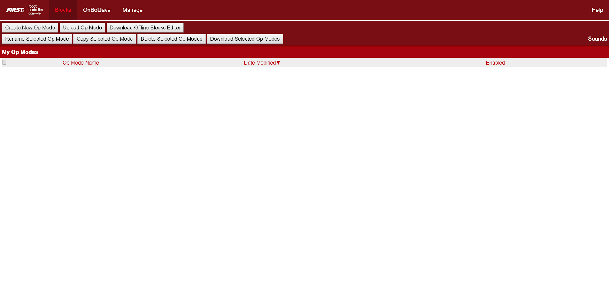
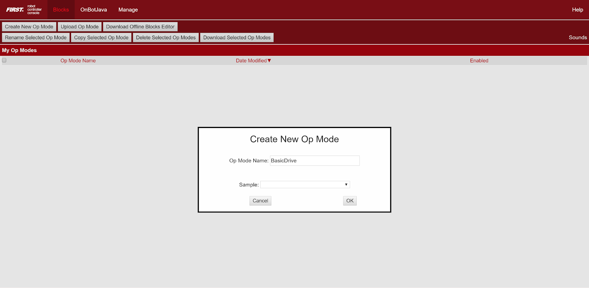
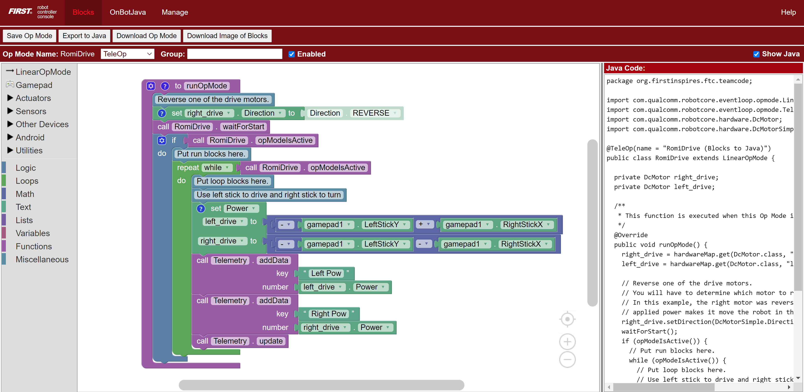
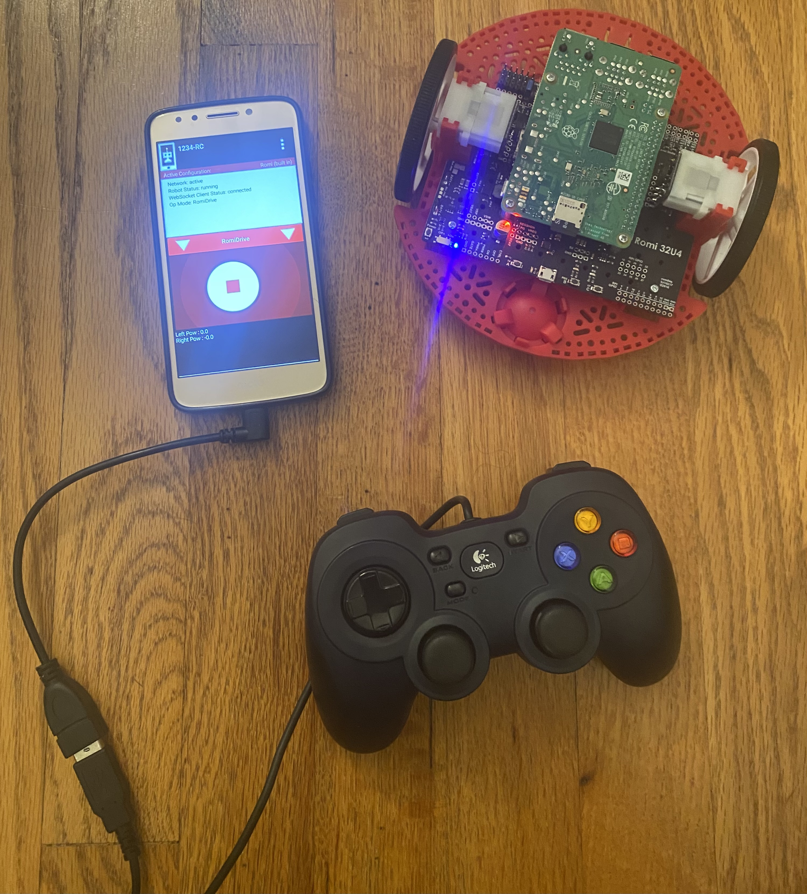

Basic Program
=============
This guide will step through creating a basic Blocks program to test that our Romi works.

Programming the Romi works the same way as programming a full-sized FTC robot.
Thus, the following steps also apply to real FTC programming.

From here, click the **Blocks** tab at the top. This will take you to this page:

Basic POV Drive Sample
----------------------

This page will contain any **OpModes** – programs that control your robot – that you have written.
Since we have not wrote any, it is currently empty.
There are also some buttons on the top. Let’s click on the "Create a New Op Mode" option to create a new program.
This will pop up:

This menu allows you to name your new OpMode and select a sample to base it off of.
For this guide, let's name the OpMode **RomiDrive**. For the **Sample**, select **BasicPOVDrive**.
Then click **OK**.

The new OpMode should have code that looks like this:

The sample **BasicPOVDrive** should already contain basic drive code that can control the Romi!

Running the OpMode
------------------
The OpMode should now be available to select on the phone's Driver Station.
Click `here <app.html#the-driver-station>`_ for a refresher on the Driver Station portion of the FTC app.

Ensure that the Romi is connected to the phone.
Click `here <app.html#connection-status>`_ for a refresher on how to do this.

To run the selected OpMode, press the large "INIT" button to initialize the robot and then press it again to start the robot.
You should now able to connect a gamepad to phone and control the Romi with the joysticks.

Final Setup
-----------

As reference, your final setup (excluding your computer) should look something like this:

