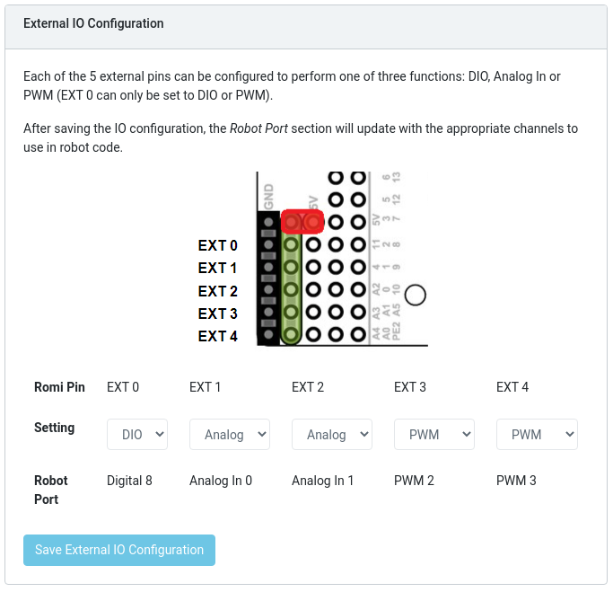

Hardware Configuration
======================
Typically before programming your robot in FTC, you have to configure and name all of the devices on your robot.
However, in the Romi FTC app, this feature is absent.

This is because the Romi devices are already configured and named in the Romi FTC app, so you can start using them in your Romi code right away!

Configured Devices
------------------
If you are programming in Blocks, all of the configured devices will be available in the Blocks toolbox.
If you are programming in Java, you can access the devices from the ``HardwareMap`` as usual, for example:

.. code-block:: java

  DcMotor leftDrive = HardwareMap.dcMotor.get("left_drive");

The following are all of the available hardware devices on the Romi and their features:

Motors (``DcMotor``)
^^^^^^^^^^^^^^^^^^^^^^^

The motors support basic position control using the encoders. However, they currently do not support more advanced features such as velocity control.

.. list-table::
   :widths: 25 75
   :header-rows: 1

   * - Name
     - Romi Hardware Component
   * - ``"left_drive"``
     - Left Motor
   * - ``"right_drive"``
     - Right Motor

Digital inputs/outputs (``DigitalChannel``)
^^^^^^^^^^^^^^^^^^^^^^^^^^^^^^^^^^^^^^^^^^^^

The DIO allow access to the buttons and lights on the Romi. Each channel will have a different functionality depending on
if it is set as an input or output, as described in the table.

.. list-table::
   :widths: 25 75
   :header-rows: 1

   * - Name
     - Romi Hardware Component
   * - ``"dio_0"``
     - Button A (input only)
   * - ``"dio_1"``
     - Button B (input), Green LED (output)
   * - ``"dio_2"``
     - Button C (input), Red LED (output)
   * - ``"dio_3"``
     - Yellow LED (output only)

Gyro (``GyroSensor``)
^^^^^^^^^^^^^^^^^^^^^

There is one gyro sensor named ``"gyro"``. If using Java, this is of type ``GyroSensor`` in the ``HardwareMap``,
but you will want to cast it to ``IntegratingGyroscope`` to access all of its features. You can do that like this:

.. code-block:: java

  IntegratingGyroscope gyro = (IntegratingGyroscope) HardwareMap.gyroSensor.get("gyro");

Accelerometer (``AccelerationSensor``)
^^^^^^^^^^^^^^^^^^^^^^^^^^^^^^^^^^^^^^^

There is one accelerometer named ``"accelerometer"``. If using Java, this is of type ``AccelerationSensor` in the ``HardwareMap``.

External IO
^^^^^^^^^^^
The Romi robot has 5 additional pins which can be connected to external devices.
These pins can be configured to either DIO, Analog In, or PWM using the Romi Web UI.
When you configure these pins, the Web UI will display their types and numbers (for instance, **Digital 8**):

You can then access these devices in your code using the appropriate hardware names:

``DigitalChannel``
""""""""""""""""""

.. list-table::
   :widths: 25 25
   :header-rows: 1

   * - Name
     - Web UI Name
   * - ``"dio_extra_8"``
     - Digital 8
   * - ``"dio_extra_9"``
     - Digital 9
   * - ``"dio_extra_10"``
     - Digital 10
   * - ``"dio_extra_11"``
     - Digital 11
   * - ``"dio_extra_12"``
     - Digital 12

``AnalogInput``
""""""""""""""""""

.. list-table::
   :widths: 25 25
   :header-rows: 1

   * - Name
     - Web UI Name
   * - ``"analog_0"``
     - AnalogIn 0
   * - ``"analog_1"``
     - AnalogIn 1
   * - ``"analog_2"``
     - AnalogIn 2
   * - ``"analog_3"``
     - AnalogIn 3

PWM (``DcMotor`` or ``Servo``)
"""""""""""""""""""""""""""""""
Each external port configured as **PWM** can either be used as a ``DcMotor`` or ``Servo`` in your FTC code.

.. list-table::
   :widths: 25 25 25
   :header-rows: 1

   * - ``DcMotor`` Name
     - ``Servo`` Name
     - Web UI Name
   * - ``"motor_extra_2"``
     - ``"servo_2"``
     - PWM 2
   * - ``"motor_extra_3"``
     - ``"servo_3"``
     - PWM 3
   * - ``"motor_extra_4"``
     - ``"servo_4"``
     - PWM 4
   * - ``"motor_extra_5"``
     - ``"servo_5"``
     - PWM 5
   * - ``"motor_extra_6"``
     - ``"servo_6"``
     - PWM 6
