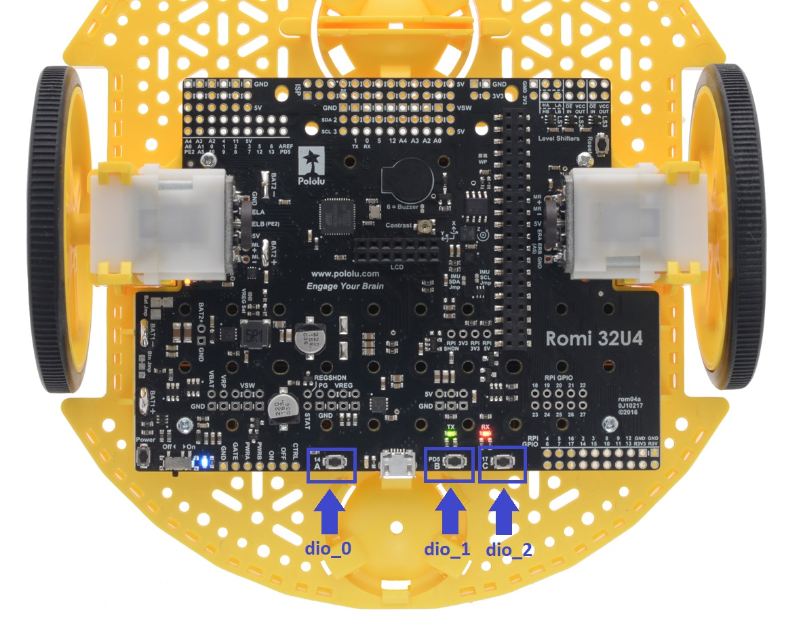

Buttons
=======

Hardware
^^^^^^^^
The Romi has three small push buttons that you can use to control your code.
These LED's are considered **digital channels**, specifically **digital inputs**.
These means that when you read them, they can be one of two states: ``true`` or ``false``.

The FTC Romi app already provides names for these devices to use in your code.
Button A is ``"dio_0"``, B is ``"dio_1"``, and C is ``"dio_2"``.

Notice that these DIO device names overlap with some of the LED devices from the last guide.
You can only use each DIO device as an LED (output) **or** a push button (not both).
You can control this by setting the device's mode to either **output** or **input**.

The locations of the buttons are shown below:

.. tabs::

    .. group-tab:: Blocks

        If you are using Blocks, you can already access these devices through the toolbox on left when writing code!

        .. image:: images/leds/toolbox.png
            :width: 400px

    .. group-tab:: Java

        If you are using Java, you will need to get these devices from the ``HardwareMap`` in order to use them.
        Add the highlighted code in the "init" section of your code (right after ``public void runOpMode()``)

        .. code-block:: java
            :emphasize-lines: 2, 3, 4

            public void runOpMode() {
                DigitalChannel dio_0 = hardwareMap.get(DigitalChannel.class, "dio_0");
                DigitalChannel dio_1 = hardwareMap.get(DigitalChannel.class, "dio_1");
                DigitalChannel dio_2 = hardwareMap.get(DigitalChannel.class, "dio_2");
                // ...rest of init code...
                waitForStart();
                // ...rest of run code...
            }

Configuration
^^^^^^^^^^^^^
In order to use these digital channels as **inputs**, we have to configure them as such in the **init** section of our code.
We can do this with ``setMode``:

.. tabs::

    .. group-tab:: Blocks

        .. image:: images/buttons/input.png
            :width: 550px

    .. group-tab:: Java

        .. code-block:: java

            dio_0.setMode(DigitalChannel.Mode.INPUT);
            dio_1.setMode(DigitalChannel.Mode.INPUT);
            dio_2.setMode(DigitalChannel.Mode.INPUT);

Reading the Buttons
^^^^^^^^^^^^^^^^^^^
The push button devices are **digital inputs**, meaning that they can be one of two states: ``true`` or ``false``.
As you may expect, the state ``true`` indicates that the button is press, and the state ``false`` indicates that the button is not pressed.
We can read a digital input's state by using ``getState``

To test that we can read the states of the buttons, we can add some basic code to the **loop** section of our code
that outputs the states of each button to the **telemetry** (the screen on the Driver Station app).
Add the highlighted code right before the ``telemetry.update()`` line/block.

.. tabs::

    .. group-tab:: Blocks

        The ``telemetry.addData`` block is under **Utilities -> Telemetry** in the toolbox.
        Make sure to use the block that has a parameter called **text** rather than the one with a parameter called **number**.

        .. image:: images/buttons/telem.png
            :width: 440px

    .. group-tab:: Java

        .. code-block:: java
            :emphasize-lines: 3, 4, 5

            while (opModeIsActive()) {
              // Put loop blocks here.
              telemetry.addData("Button A", dio_0.getState());
              telemetry.addData("Button B", dio_1.getState());
              telemetry.addData("Button C", dio_2.getState());
              telemetry.update();
            }

Using Button Inputs
^^^^^^^^^^^^^^^^^^^
Now we can do something more complicated with the buttons.
Let's make it so that while you are holding down a button, the robot moves in a certain way.

We can do this by using an **if** statement.
Code in an **if** statement will only be ran if a certain **condition** is ``true``.
For instance, we can make it that **if** button A is being pressed, **then** the robot will move forward at 30% speed.
In this case, the condition is that the state of ``dio_0`` is ``true``.

Add the following code right before the telemetry blocks/lines that we added earlier, but do not run this code yet:

.. tabs::

    .. group-tab:: Blocks

        You can grab the **if** block from the **Logic** tab of the toolbox.

        .. image:: images/buttons/forward.png
            :width: 350px

    .. group-tab:: Java

        .. code-block:: java

            if (dio_0.getState()) {
              left_drive.setPower(0.3);
              right_drive.setPower(0.3);
            }

This code may look good, but it contains one major flaw: if we stop pressing push button A, the robot will continue
moving forward at ``0.3`` power because we never tell it to stop!

To fix this, we will add an **else** case to our if statement.
An else case tells the program what we should do if the condition is **not** ``true`` (meaning that it is ``false``).
Add an else case to the if statement to set the drive motor powers to ``0``.

.. tabs::

    .. group-tab:: Blocks

        You can modify the if statement by clicking the gear on the statement and dragging the "else" block below the "if" block
        (shown in the picture below).

        .. image:: images/buttons/forward_stop.png
            :width: 420px

    .. group-tab:: Java

        .. code-block:: java

            if (dio_0.getState()) {
              left_drive.setPower(0.3);
              right_drive.setPower(0.3);
            } else {
              left_drive.setPower(0);
              right_drive.setPower(0);
            }

Finally, let's extend our if statement even further.
We can add additional conditions to our if statement by using **else if** blocks.
Else if blocks should in between the if block and the else block.

Let's make it so that push buttons B (``dio_1``) and C (``dio_2``) make the robot turn left or right while pressed (respectively).
Here is the full logic that we are going to create with our if statement:

- **If** push button A is pressed, the robot moves forward.
- **Else**, **if** push button B is pressed, the robot turns left.
- **Else**, **if** push button C is pressed, the robot turns right.
- **Else** (otherwise), stop the robot.

The if statement code should now look like this:

.. tabs::

    .. group-tab:: Blocks

        You can modify the if statement by clicking the gear on the statement and dragging the "else if" blocks below the "if" block
        (shown in the picture below).

        .. image:: images/buttons/turn.png
            :width: 400px

    .. group-tab:: Java

        .. code-block:: java

            if (dio_0.getState()) {
              left_drive.setPower(0.3);
              right_drive.setPower(0.3);
            } else if (dio_1.getState()) {
              left_drive.setPower(0);
              right_drive.setPower(0.3);
            } else if (dio_2.getState()) {
              left_drive.setPower(0.3);
              right_drive.setPower(0);
            } else {
              left_drive.setPower(0);
              right_drive.setPower(0);
            }

Full Code
^^^^^^^^^

.. tabs::

    .. group-tab:: Blocks

        .. image:: images/buttons/code.png

    .. group-tab:: Java

        .. code-block:: java

            package org.firstinspires.ftc.teamcode;

            import com.qualcomm.robotcore.eventloop.opmode.LinearOpMode;
            import com.qualcomm.robotcore.eventloop.opmode.TeleOp;
            import com.qualcomm.robotcore.hardware.DcMotor;
            import com.qualcomm.robotcore.hardware.DigitalChannel;

            @TeleOp(name = "Buttons")
            public class Buttons extends LinearOpMode {
              /**
               * This function is executed when this Op Mode is selected from the Driver Station.
               */
              @Override
              public void runOpMode() {
                DcMotor left_drive = hardwareMap.get(DcMotor.class, "left_drive");
                DcMotor right_drive = hardwareMap.get(DcMotor.class, "right_drive");
                DigitalChannel dio_0 = hardwareMap.get(DigitalChannel.class, "dio_0");
                DigitalChannel dio_1 = hardwareMap.get(DigitalChannel.class, "dio_1");
                DigitalChannel dio_2 = hardwareMap.get(DigitalChannel.class, "dio_2");

                // Put initialization blocks here.
                dio_0.setMode(DigitalChannel.Mode.INPUT);
                dio_1.setMode(DigitalChannel.Mode.INPUT);
                dio_2.setMode(DigitalChannel.Mode.INPUT);
                waitForStart();
                if (opModeIsActive()) {
                  // Put run blocks here.
                  while (opModeIsActive()) {
                    // Put loop blocks here.
                    if (dio_0.getState()) {
                      left_drive.setPower(0.3);
                      right_drive.setPower(0.3);
                    } else if (dio_1.getState()) {
                      left_drive.setPower(0);
                      right_drive.setPower(0.3);
                    } else if (dio_2.getState()) {
                      left_drive.setPower(0.3);
                      right_drive.setPower(0);
                    } else {
                      left_drive.setPower(0);
                      right_drive.setPower(0);
                    }
                    telemetry.addData("Button A", dio_0.getState());
                    telemetry.addData("Button B", dio_1.getState());
                    telemetry.addData("Button C", dio_2.getState());
                    telemetry.update();
                  }
                }
              }
            }