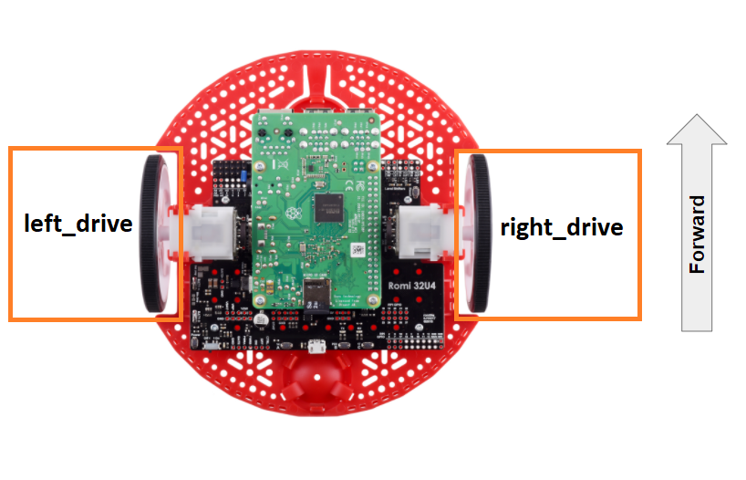

Drive Motor
===========

Hardware
^^^^^^^^
The simplest device that we can control on the Romi robot is a DC Motor.
A DC Motor is a motor that will continuously run at any power you set it at.
The Romi has two DC Motors for driving: one on the left wheel, one on the right wheel.

The FTC Romi app already provides names for these devices to use in your code.
These names are ``"left_drive"`` and ``"right_drive"``

.. tabs::

    .. group-tab:: Blocks

        If you are using Blocks, you can already access these devices through the toolbox on left when writing code!

        .. image:: images/drive_motor/toolbox.png
            :width: 50%

    .. group-tab:: Java

        If you are using Java, you will need to get these devices from the ``HardwareMap`` in order to use them.
        Add the highlighted code in the "init" section of your code (right after ``public void runOpMode()``)

        .. code-block:: java
            :emphasize-lines: 2, 3

            public void runOpMode() {
                DcMotor left_drive = hardwareMap.get(DcMotor.class, "left_drive");
                DcMotor right_drive = hardwareMap.get(DcMotor.class, "right_drive");
                // ...rest of init code...
                waitForStart();
                // ...rest of run code...
            }

Direction
^^^^^^^^^
Before we control our motors, we have to make sure that the direction of each motor is correct — when each motor turns “forward”, the robot should move forward.

If you look at the Romi robot, you will notice that the motors are mounted in **opposite directions**.
This means that if we tried to move before motors "forward", they would actually move in opposite directions,
causing the robot to spin.

To fix this, we can **reverse** the direction of our right motor in the **init** section of our code.

The following code should be place directly before the ``waitForStart`` block/line.
This ensures that we set the correct motor direction before the program even starts running.

.. tabs::

    .. group-tab:: Blocks

        .. image:: images/drive_motor/reverse.png
            :width: 550px

    .. group-tab:: Java

        .. code-block:: java

            right_drive.setDirection(DcMotorSimple.Direction.REVERSE);

Control
^^^^^^^
DC motors are controlled by setting the **power** value of the motor.
A power value of **0** stops the motor, a power value of **1** runs the motor at **100% power (speed) forward**, and a power value of **-1** runs the motor at **100% power backwards**.

Power values can also be decimals, which will make the motor go slower.
For instance, a power value of **-0.3** would run the motor at 30% power backwards.

To test our motors, let’s simply run both of them at 30% power (note: we are going to run it at 30% rather than 100% because when you first test a motor, it is a good habit to run it at a slower speed in case something goes wrong).
Add this code to the loop section of your program to accomplish this:

.. tabs::

    .. group-tab:: Blocks

        .. image:: images/drive_motor/forward.png
            :width: 200px

    .. group-tab:: Java

        .. code-block::

            left_drive.setPower(0.3);
            right_drive.setPower(0.3);

Now if you run your program, the robot should move forward at a fairly slow speed. Once you confirm that the motors are working, you can try to change the power values in the code to make the robot forward or backward at different speeds.

You can also try using different power values for each motor to cause the robot to turn
(for example, setting the **left motor to 1** and the **right motor to -1** will cause the robot to turn right).

Full Code
^^^^^^^^^

.. tabs::

    .. group-tab:: Blocks

        .. image:: images/drive_motor/code.png

    .. group-tab:: Java

        .. code-block:: java

            package org.firstinspires.ftc.teamcode;

            import com.qualcomm.robotcore.eventloop.opmode.LinearOpMode;
            import com.qualcomm.robotcore.eventloop.opmode.TeleOp;
            import com.qualcomm.robotcore.hardware.DcMotor;
            import com.qualcomm.robotcore.hardware.DcMotorSimple;

            @TeleOp(name = "POVDrive (Blocks to Java)")
            public class POVDrive extends LinearOpMode {
              /**
               * This function is executed when this Op Mode is selected from the Driver Station.
               */
              @Override
              public void runOpMode() {
                DcMotor left_drive = hardwareMap.get(DcMotor.class, "left_drive");
                DcMotor right_drive = hardwareMap.get(DcMotor.class, "right_drive");

                // Put initialization blocks here.
                // You will have to determine which motor to reverse for your robot.
                // In this example, the right motor was reversed so that positive
                // applied power makes it move the robot in the forward direction.
                right_drive.setDirection(DcMotorSimple.Direction.REVERSE);
                waitForStart();
                if (opModeIsActive()) {
                  // Put run blocks here.
                  while (opModeIsActive()) {
                    // Put loop blocks here.
                    left_drive.setPower(0.3);
                    right_drive.setPower(0.3);
                    telemetry.update();
                  }
                }
              }
            }