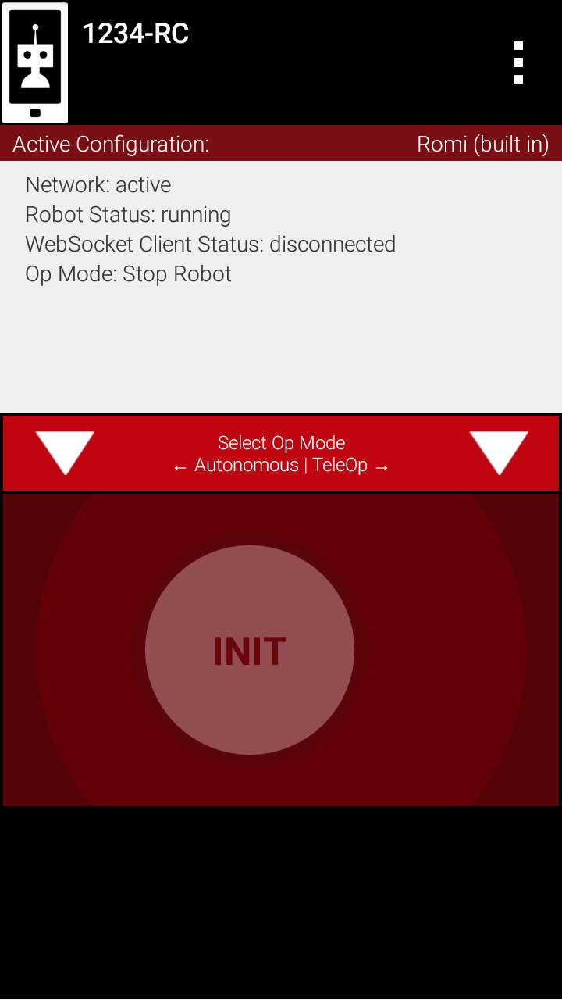
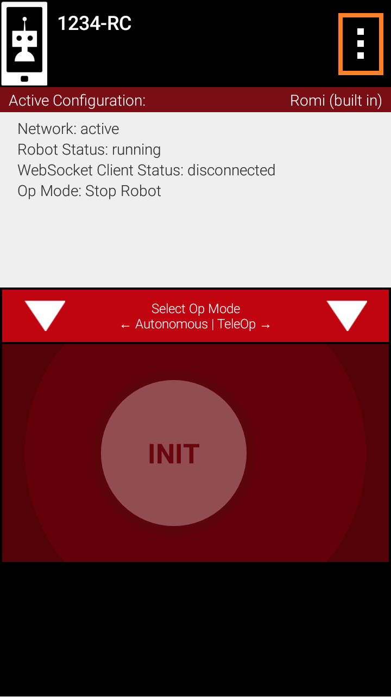
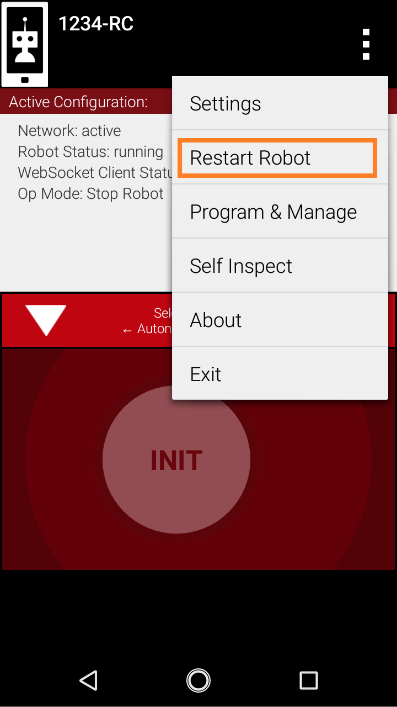

Getting to know the FTC app
===========================

Background
----------

On a full-sized FTC robot, there are typically two Android devices each running a different app.

The device on the robot is called the Robot Controller, and is considered the "brain" of the robot. It also contains all of the code the user writes.

The other device is called the Driver Station, which the person driving the robot can use to initialize, start, and stop the robot. They can also connect a gamepad to the Driver Station to control the robot.

The FTC Romi app conveniently **combines these two apps into one app**.
These means that you can code and drive your robot with the same app on only one phone.

The App
-------

The home screen of the FTC Romi app contains the Robot Controller portion on the top and the Driver Station portion on the bottom:

Connection Status
^^^^^^^^^^^^^^^^

Notice the text labelled "WebSocket Client Status":

.. image:: images/status.png
   :scale: 25 %
   :alt: WebSocket Client Status

This indicates if your Romi robot is connected to the phone. The status must be "connected" in order to control the Romi.

Restart Robot
^^^^^^^^^^^^^

If the status is "disconnected", but your Romi is on and properly setup, you can restart the robot to try to connect to the Romi again.
Click on the three dots in the top right to open the app's menu:

Then, click on "Restart Robot":

The Driver Station
^^^^^^^^^^^^^^^^^^
The lower half of the screen contains the Driver Station.
The Driver Station allows you to select and run your OpModes (programs) as you would on a real FTC Driver Station.
The Driver Station does **not** display connected gamepads, since you can only connect one gamepad controller to the phone.