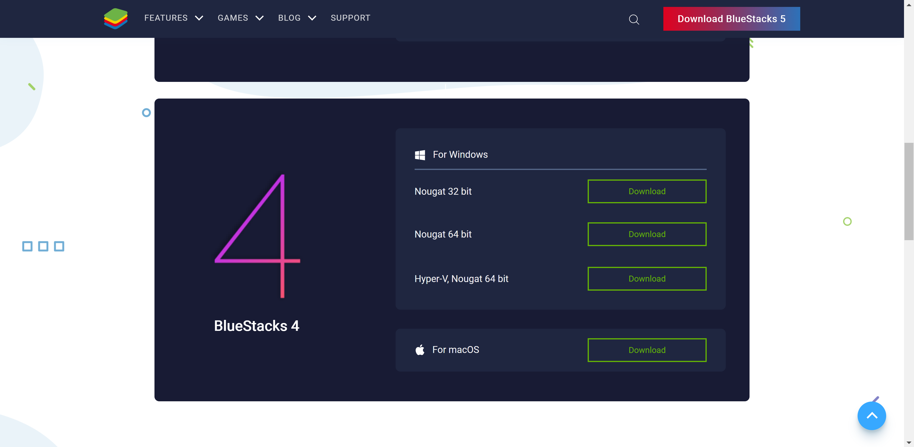
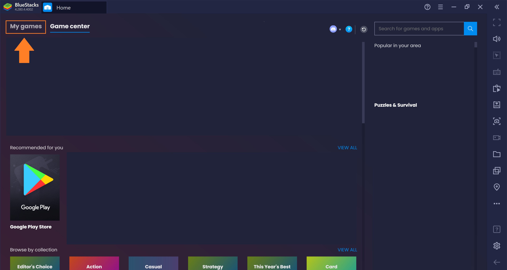
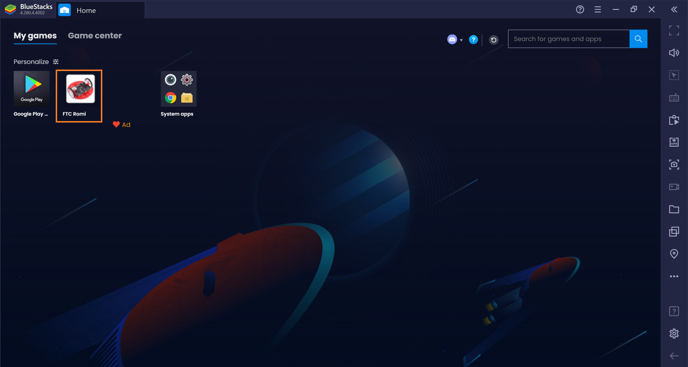
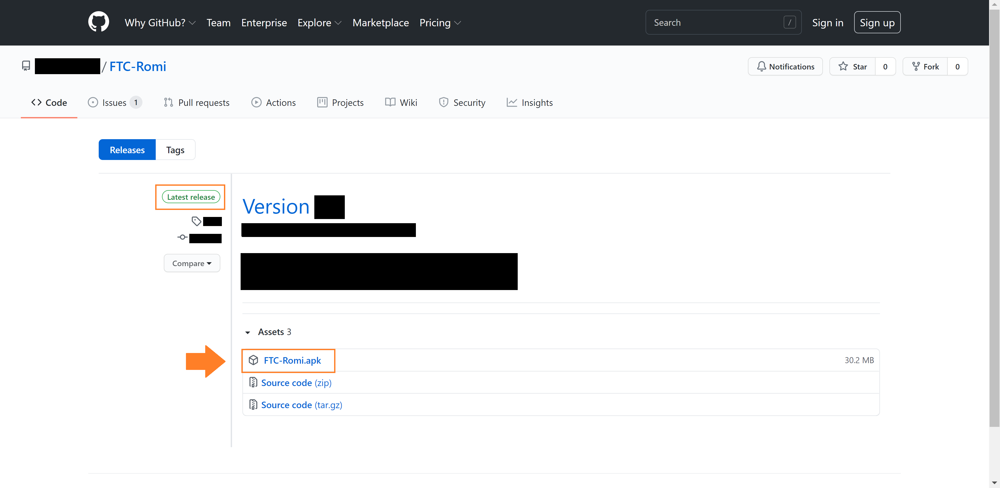
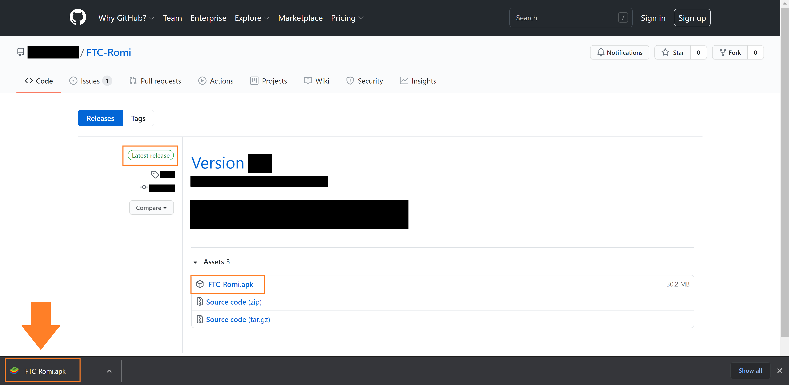
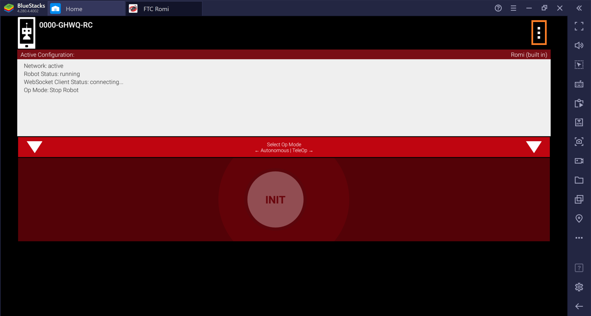
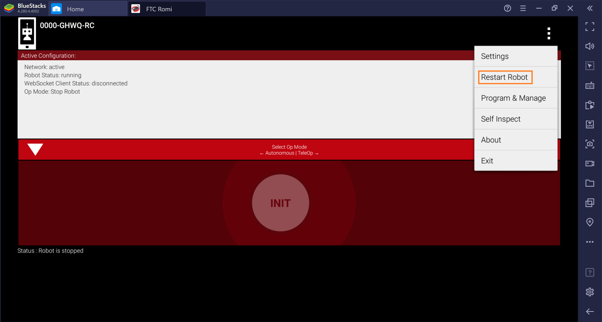
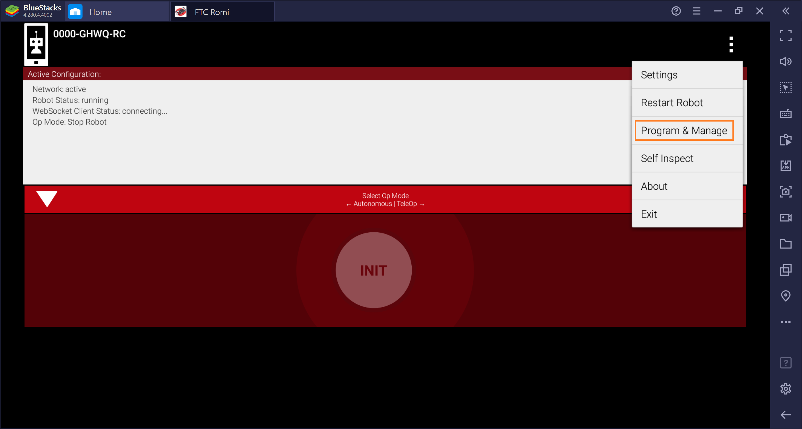
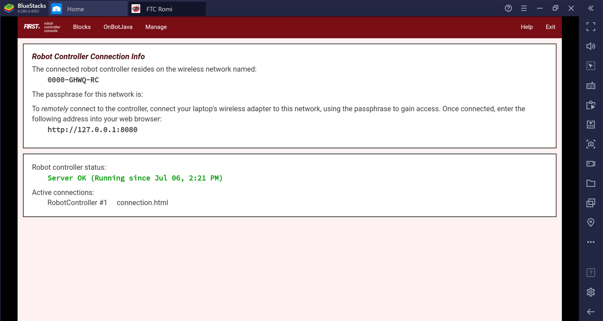

Computer Setup
==============

The FTC Romi app can be either used with a real Android phone **or** a computer.
If you wish to use a phone rather than a computer, follow `this guide <phone.html>`_ instead.

Emulator
--------
You will first need to install an **emulator** on your computer to run the FTC Romi app.
An emulator is a program that basically "pretends" to be an Android phone.

We recommend an emulator called **BlueStacks 4**.
To install BlueStacks 4, navigate to the website's download page (https://www.bluestacks.com/download.html) and scroll down to BlueStacks 4:

**Note: it is important you download BlueStacks 4 rather than BlueStacks 5, because BlueStacks 5 does not work with a gamepad.**

For Windows, you probably want to download **Nougat 64 bit**.

After downloading the installer, open it and click through it until BlueStacks 4 is installed.
The program contains a few advertisements, so be sure to avoid clicking those
(for example, avoid clicking buttons that say "Play Now" or "Install Now").

Once BlueStacks opens and loads, you will be greeted by the following page.
You will always want to click **"My Games"** at the top to access the apps you have installed:

This will take you to the following screen.
Once you install the FTC Romi app later in this game, it will show up on this screen:

App Download
------------
The app file can be downloaded from GitHub.
Navigate to https://github.com/Nolan1324/FTC-Romi/releases/latest in your browser and click on ``FTC-Romi.apk``.

Make sure you are downloading the `Latest release`.
The image below shows exactly where to find this:

After downloading, you should be able to simply open the file and BlueStacks will automatically install it.
If this doesn't work, you can always just drag the file into BlueStacks instead.

Once it is installed, you should be able to open it from the "My Games" section of BlueStacks!
If the app crashes when first opening it, just try opening it again:

Connecting to Romi
-----------------------
If you set your Romi according to the `previous guide <romi.html>`_, then you can now connect to the Romi's WiFi.
By simply connection your computer to the Romi's WiFi network, the emulated app should automatically conenct to the Romi.
If your do not see your Romi's WiFi, ensure your Romi has been turned on for about a minute.

The "WebSocket Client Status" in the app indicates if it is connect to the Romi, as shown below.
If it is "disconnected", do a "Restart Robot" like so (this pictures are from a phone but it works the same on a computer):

Robot Controller Console
------------------------

To start programming, you need to access the **Robot Controller Console**.

Since the app is emulated on your computer, you can only access the Robot Controller Console in the app.
To access the Robot Controller Console, go to the **Program & Manage** screen of the FTC Romi app:

Now you can start programming in either **Blocks or OnBotJava** by clicking the buttons at the top!
