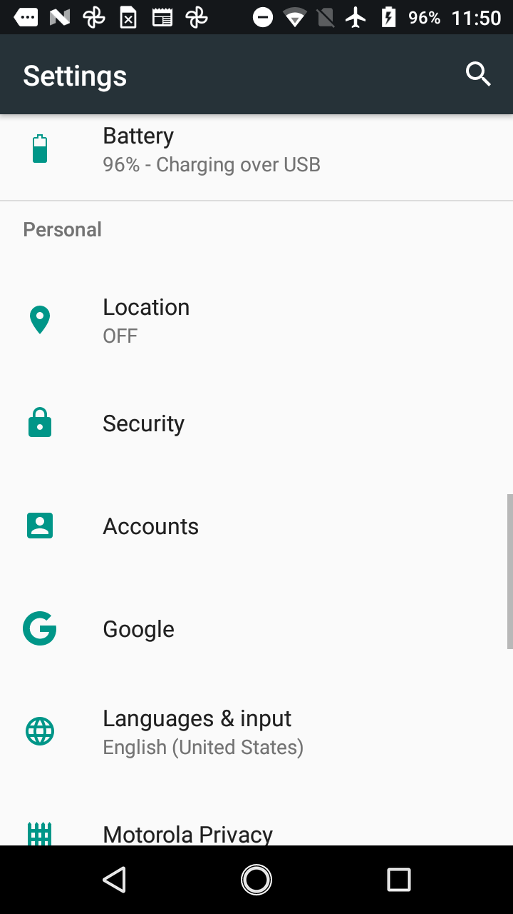
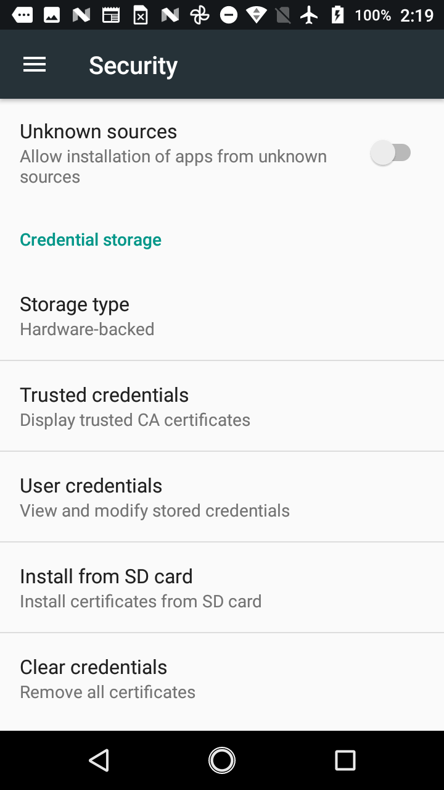

Phone Setup
===========

Hardware
--------
Phone setup will require one Android phone, preferably one supported by FTC. According to rule **<RE07>** these include:

- Motorola Moto G 2nd Generation
- Motorola Moto G 3rd Generation
- Motorola Moto G4 Play (4th Generation)/Motorola Moto G4 Play
- Motorola Moto G5
- Motorola Moto G5 Plus
- Motorola Moto E4 (USA versions only, includes SKUs XT1765, XT1765PP, XT1766, and XT1767)
- Motorola Moto E5 (XT1920)
- Motorola Moto E5 Play (XT1921)

App Download
------------
The FTC Romi app is available on GitHub, and all of the source code is publicly available.
Since the app is not from the Google Play Store, the phone will have to be configured to allow it.

Open the settings on the phone and scroll down to "Security":

After clicking on security, enable "Unknown sources":

If you would like, you can disable this setting after downloading the FTC Romi app.

To download the app, navigate to https://github.com/Nolan1324/FTC-Romi/releases/download/v1.0/FTC-Romi.apk on the phone's web browser.
This should automatically start downloading the app, which you can then click to install.
