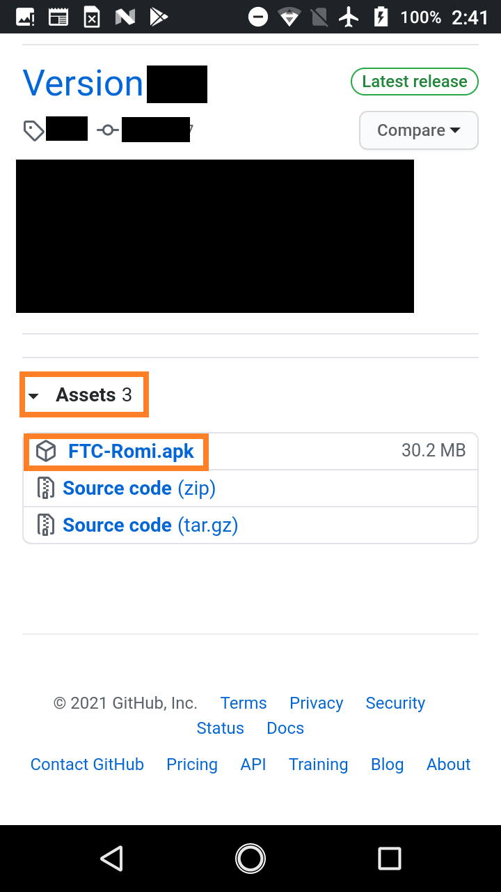

Phone Setup
===========

The FTC Romi app can be either used with a real Android phone **or** a computer.
If you wish to use a computer rather than a phone, follow `this guide <computer.html>`_ instead.

Hardware
--------
Phone setup will require one Android phone, preferably one supported by FTC. According to rule **<RE07>** these include:

- Motorola Moto G 2nd Generation
- Motorola Moto G 3rd Generation
- Motorola Moto G4 Play (4th Generation)/Motorola Moto G4 Play
- Motorola Moto G5
- Motorola Moto G5 Plus
- Motorola Moto E4 (USA versions only, includes SKUs XT1765, XT1765PP, XT1766, and XT1767)
- Motorola Moto E5 (XT1920)
- Motorola Moto E5 Play (XT1921)

App Download
------------
The FTC Romi app is available on GitHub, and all of the source code is publicly available.
Since the app is not from the Google Play Store, the phone will have to be configured to allow it.

Open the settings on the phone and scroll down to "Security":

.. image:: images/phone/phone_settings.png
   :scale: 25 %
   :alt: Settings

After clicking on security, enable "Unknown sources":

If you would like, you can disable this setting after downloading the FTC Romi app.

To download the app, navigate to https://github.com/FIRST-e4usa/FTC-Romi/releases/latest on the phone's web browser.
This will bring you to this page, where you can click ``FTC-Romi.apk`` to download the app.
You may need to click on the ``Assets`` button to reveal the download button.
After downloading, you can choose to open the app to install it.

Connecting to Romi
-----------------------

If you set your Romi according to the `previous guide <romi.html>`_, then you can now connect to your phone to the Romi's WiFi.

First, open the **settings** app on your phone and select **Wi-Fi**.

Ensure that WiFi is on, and then locate your Romi's WiFi network and click on it.
If your do not see your Romi's WiFi, ensure your Romi has been turned on for about a minute.

The "WebSocket Client Status" in the app indicates if it is connect to the Romi, as shown below.
If it is "disconnected", do a "Restart Robot" like so:

.. image:: images/menu.png
   :scale: 25 %
.. image:: images/restart.png
   :scale: 25 %

Robot Controller Console
------------------------

To start programming, you need to access the **Robot Controller Console**.

To access the Robot Controller Console, go to the **Program & Manage** screen of the FTC Romi app:

.. image:: images/phone/menu.png
   :scale: 25 %
   :alt:

From here, you can start programming directly on your phone.
However, it is highly recommended that you program on a computer by connecting it to the phone.

To connect your computer to your phone, connect to the Romi's WiFi network on your computer.
The WiFi name should match the name displayed on the phone's "Program & Manage" screen.

Once you connect to the phone's WiFi, open a web browser and navigate to the address displayed on phone's "Program & Manage".
For example, the images above show that my phone's address is ``http://10.0.0.117:8080``.

This should bring up the Robot Controller Console:

.. image:: images/phone/console.png
   :alt:
