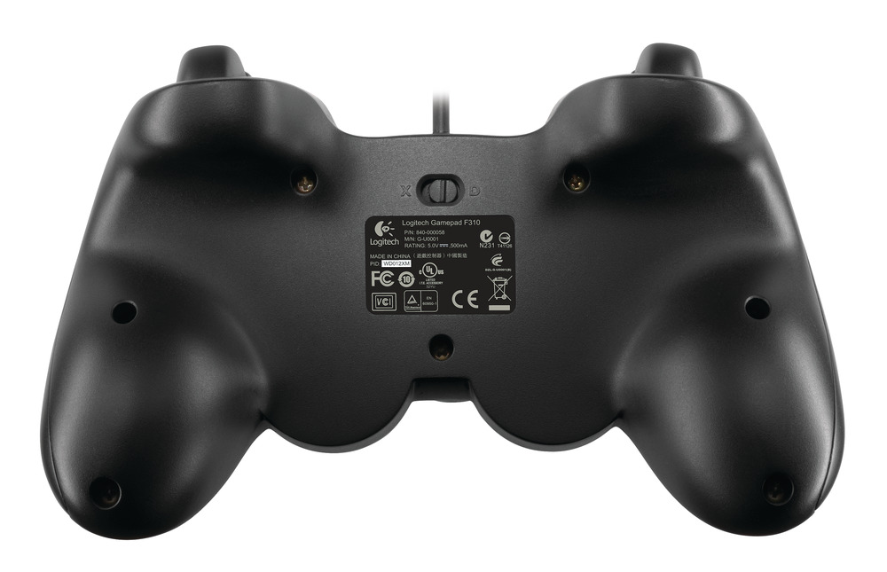

Romi Setup
==========

Hardware and Assembly
---------------------
The Romi robot requires certain hardware and assembly instructions to start using.
The FRC software documentation already has a comprehensive guide on the this process.
Follow this guide and then return here.

`Romi Hardware & Assembly <https://docs.wpilib.org/en/stable/docs/romi-robot/hardware.html>`_

Keep in mind that for running FTC Romi, you will also need either a computer **or** an Android phone to run the FTC app on.
To control the robot, you will need a wired gamepad.
**If you are using a phone**, you will also need an OTG cable to connect the gamepad to the phone.
These are items typically used on full-sized FTC robots:

- `Logitech Gamepad <https://www.amazon.com/Logitech-940-000110-Gamepad-F310/dp/B003VAHYQY>`_
- `Micro USB OTG cable <https://www.amazon.com/UGREEN-Adapter-Samsung-Controller-Android/dp/B00N9S9Z0G/>`_

Make sure that your Logitech Gamepad is in "X" mode by configuring the slider on the back:

Imaging
-------
After setting up your Romi you will need install and configure software on this.
Once again, the FRC software documentation has a guide that explains this very clearly.
Follow this guide and then return here.
Note that when it instructs you to download "Romi WPILibPi" on the "Imaging your Romi" page,
you will need to download an older version: **WPILibPi_image-v2021.2.1-Romi**.
You can download it from WPILib `here <https://github.com/wpilibsuite/WPILibPi/releases/tag/v2021.2.1>`_.

`Imaging your Romi <https://docs.wpilib.org/en/stable/docs/romi-robot/imaging-romi.html>`_

