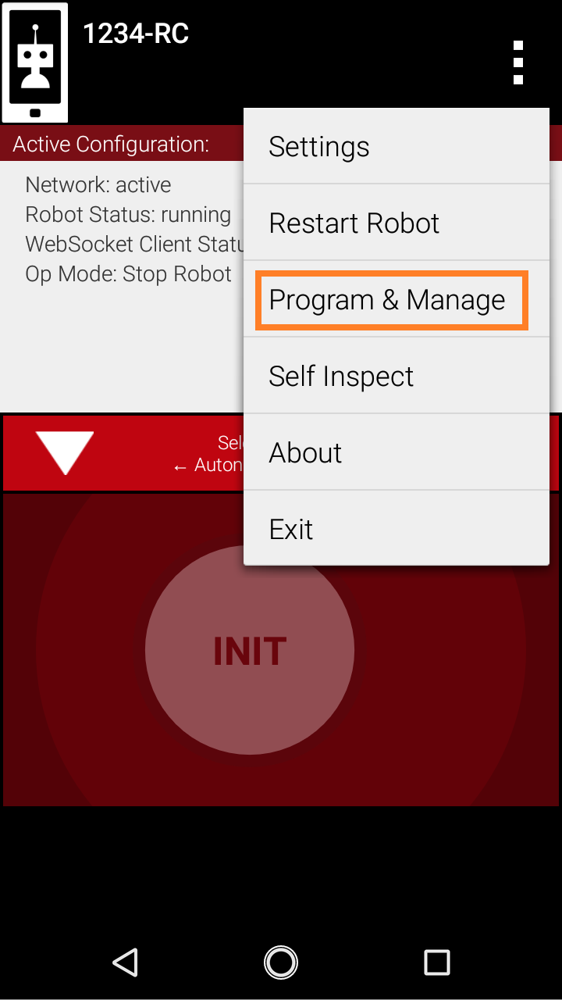
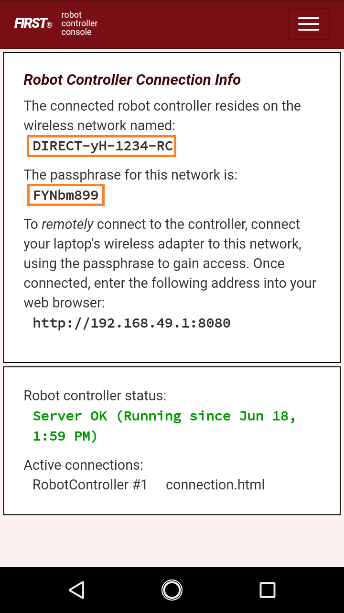
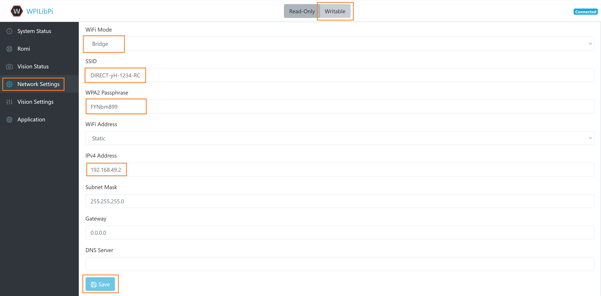

Romi Setup
==========

Hardware and Assembly
---------------------
The Romi robot requires certain hardware and assembly instructions to start using.
The FRC software documentation already has a comprehensive guide on the this process.
Follow this guide and then return here:

`Romi Hardware & Assembly <https://docs.wpilib.org/en/stable/docs/romi-robot/hardware.html>`_

Keep in mind that for running FTC Romi, you will also need an Android phone to run the FTC app on.
To control the robot, you will need a wired gamepad and an On The Go cable to connect the gamepad to the phone.
These are items typically used on full-sized FTC robots:

- `Logitech Gamepad <https://www.amazon.com/Logitech-940-000110-Gamepad-F310/dp/B003VAHYQY>`_
- `Micro USB OTG cable <https://www.amazon.com/UGREEN-Adapter-Samsung-Controller-Android/dp/B00N9S9Z0G/>`_

Make sure that your Logitech Gamepad is in "X" mode by configuring the slider on the back:

.. image:: images/logitech_back.jpeg
   :scale: 25 %
   :alt: Back of Logitech Gamepad

Imaging
-------
After setting up your Romi you will need install and configure software on this.
Once again, the FRC software documentation has a guide that explains this very clearly.
Follow this guide and then return here:

`Imaging your Romi <https://docs.wpilib.org/en/stable/docs/romi-robot/imaging-romi.html>`_

The above guide will instruct you to connect to the Romi's dashboard through a web browser.
After completing the guide, keep this dashboard open.

Network Configuration
---------------------
There is one last step we must complete to make the Romi work with the FTC phone.

Currently, the Romi is hosting its own WiFi network.
However, we want the Romi to instead connect to the WiFi direct network on our phone.
Through the phone's FTC app, you can find its WiFi network SSID and password like so:

.. image:: images/menu.png
   :scale: 25 %
   :alt:

Now, navigate to the "Network Settings" menu of the Romi dashboard and configure the following settings.
Before configuring, select "Writeable" at the top. Then configure the following:

- WiFi mode: **Bridge**
- SSID: **Network name from the phone**
- WPA2 Passphrase: **Passphrase from the phone**
- IPv4 Address: **192.168.49.2** (make sure this is exact!)

**Only press "Save" after configuring and double checking all of the above settings!**

See this picture as an example:

Saving will automatically disconnect you from the dashboard.
Wait at least one minute before rebooting the Romi.

From now own, to access the dashboard, you must navigate to either ``http://192.168.49.2`` or ``http://wpilibpi.local``
either on the phone or on a computer that is connected to the phone's WiFi network.

