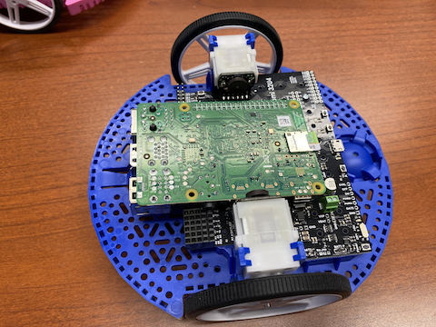

.. include:: <isonum.txt>

.. FTC Romi documentation master file, created by
   sphinx-quickstart on Mon Jun 14 15:13:22 2021.
   You can adapt this file completely to your liking, but it should at least
   contain the root `toctree` directive.

Welcome to FTC Romi's documentation!
====================================

What is FTC Romi?
-------------------------

The Romi robot is a small and affordable robot that was recently adopted for use by *FIRST*\ |reg| Robotics Competition (**FRC**) participants.
It enables users to write real FRC robot code and run it on this robot, allowing them to learn and practice hands on FRC programming without needed a full-sized FRC robot.

FTC Romi is an open-source project that brings this experience to the *FIRST*\ |reg| Tech Challenge (**FTC**) program.
In FTC, robots are controlled by an app that is downloaded to an Android phone, which they can then use to program their robot.
FTC Romi allows users to download a modified version of the FTC app and use it to control and program a Romi robot.
The FTC Romi can be downloaded to either **an Android phone or a computer**, making it flexible and easy to use.

The FTC Romi app supports both the **Blocks** and **Java** programming languages that are used in FTC, so FTC Romi is great tool for learning real FTC programming skills!

The FTC Romi app orginates from the official FTC app used in competitions, which can be found `here <https://github.com/FIRST-Tech-Challenge/FtcRobotController>`_.
The extracted packages used are from the `OpenFTC Extracted-RC repository <https://github.com/OpenFTC/Extracted-RC>`_.

This video demonstrates the functionality of the FTC Romi app using a computer with an emulator:

.. youtube:: Wyf2ZvQw2Gw

And this video demonstrates it using a phone instead:

.. youtube:: QtsjNljFKj4

To get started with setting up FTC Romi, follow the guides below:

.. toctree::
   :titlesonly:
   :caption: Setup

   docs/setup/romi
   docs/setup/computer
   docs/setup/phone

.. toctree::
   :titlesonly:
   :caption: Programming

   docs/programming/app
   docs/programming/hardware
   docs/programming/basic_program
